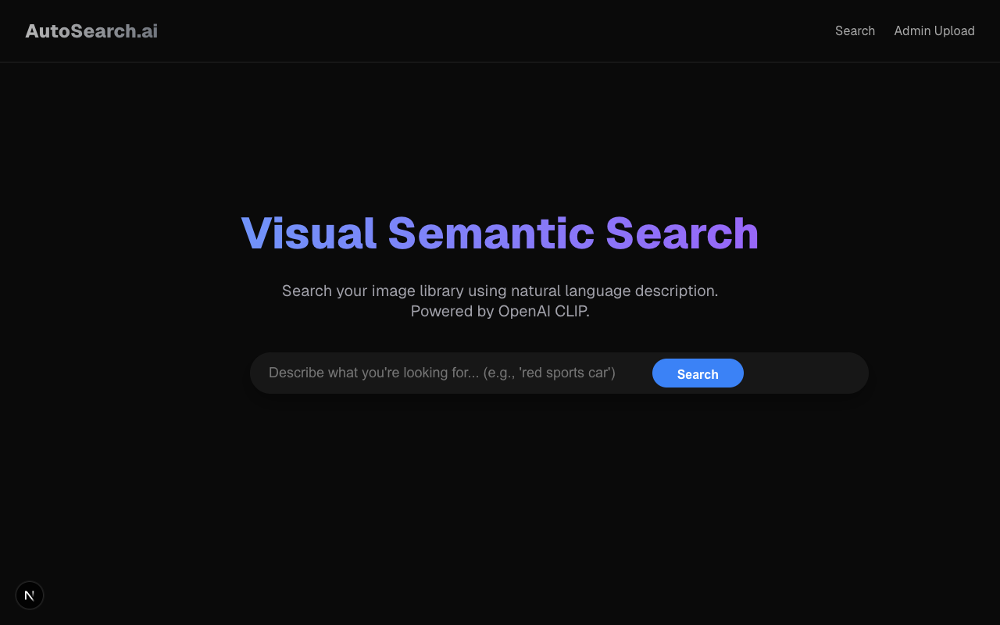
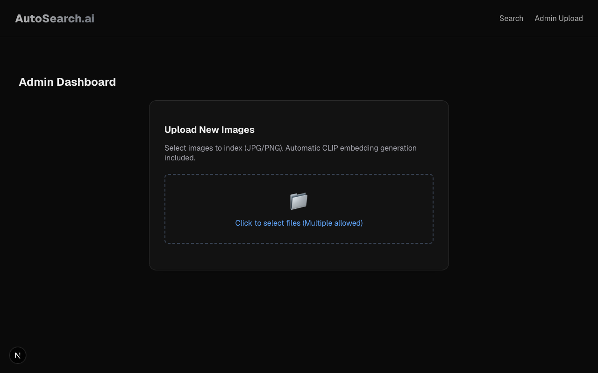

# Text-to-Image Search

A minimal viable product for automotive text-to-image search using OpenAI's CLIP model. This application allows users to upload automotive images, automatically extracts metadata and tags using AI, and performs semantic search using natural language queries.

## Screenshots

### Home & Search


### Admin & Upload


## Features

- **Semantic Search**: Search for images using natural language (e.g., "red sports car on the road") instead of just keywords.
- **AI-Powered Tagging**: Automatically generates tags for uploaded images (Color, Type, Brand, Features) using Zero-Shot Classification.
- **Metadata Extraction**: automatically extracts image dimensions and formats upon upload.
- **Hybrid Search**: Combines keyword matching with semantic vector similarity for accurate results.

## Getting Started

### Prerequisites

- Node.js (v18+)
- NPM

### Installation

1.  **Clone the repository**
2.  **Install dependencies**
    ```bash
    # Install backend dependencies
    cd backend
    npm install

    # Install frontend dependencies
    cd ../frontend
    npm install
    ```

3.  **Start the Application**
    
    Start the backend server:
    ```bash
    cd backend
    npm start
    ```
    
    Start the frontend development server:
    ```bash
    cd frontend
    npm run dev
    ```

4.  **Access the App**
    - Search Interface: [http://localhost:3000](http://localhost:3000)
    - Admin Interface: [http://localhost:3000/admin](http://localhost:3000/admin)

## technical Stack

- **Frontend**: Next.js (React)
- **Backend**: Node.js, Express
- **AI/ML**: OpenAI CLIP (via Xenova/transformers), Sharp (for image processing)
- **Database**: SQLite
